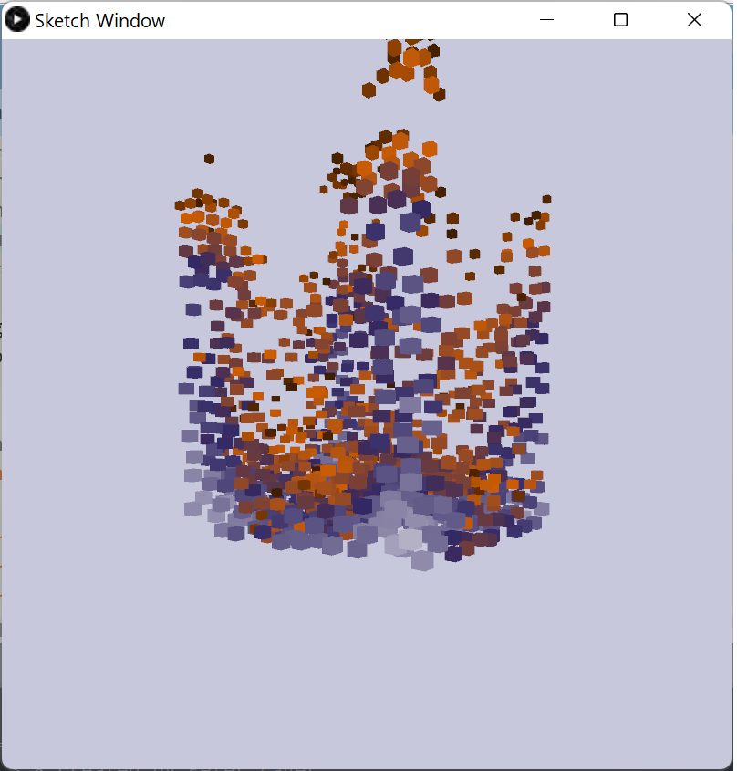
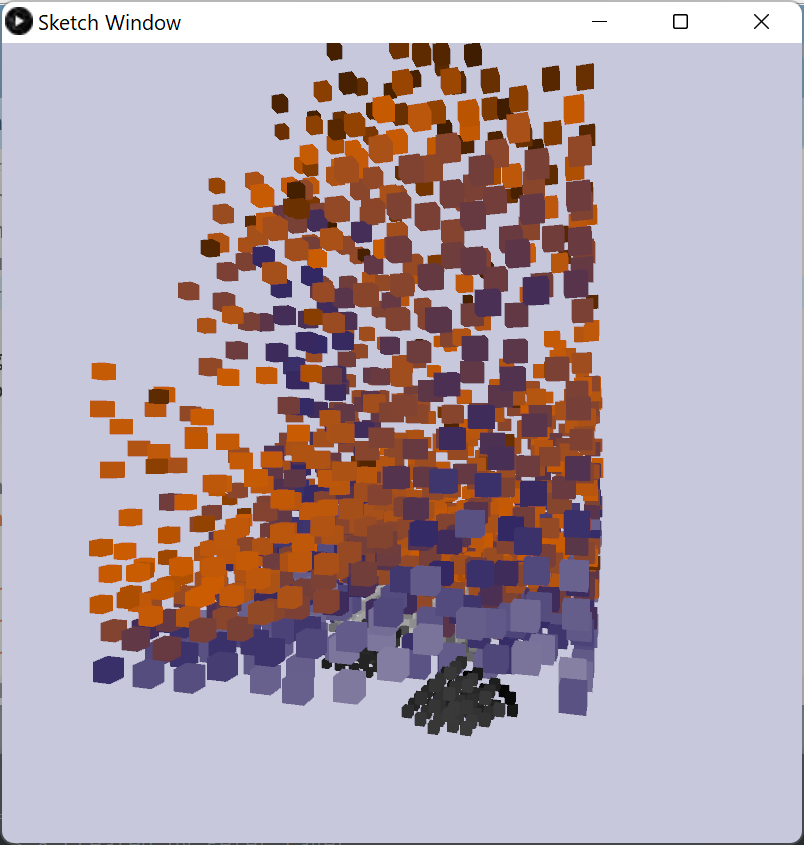
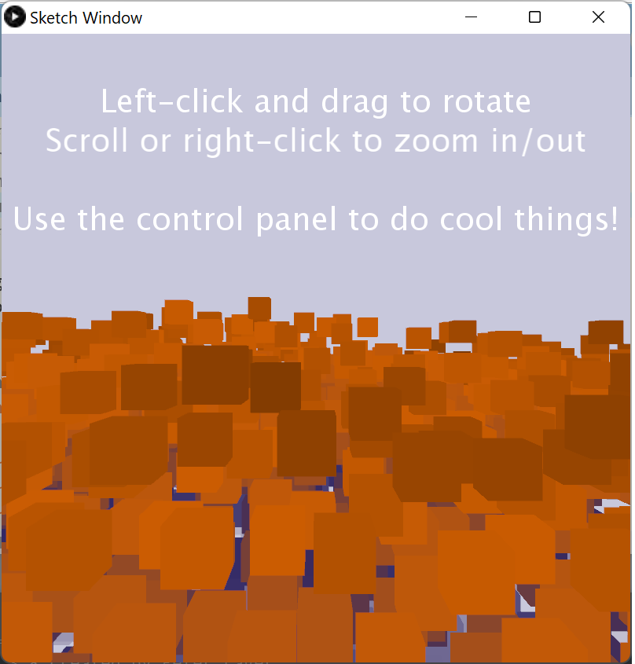
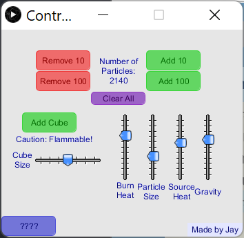

# fire-simulation
A 3D particle simulation of fire!

To use this Processing app, you'll need to install the libraries **G4P** and **PeasyCam**.

## Instructions
Left-click and drag to rotate your camera around the fire.

Scroll to zoom in or out.

Middle-click and drag to pan.

Use the control panel window to edit the fire's properties.

## Screenshots

